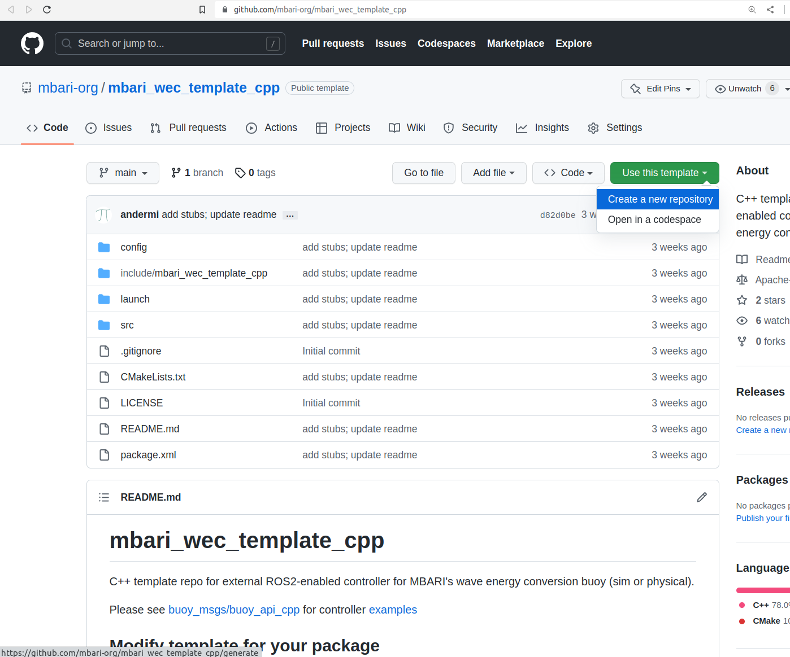

# Quick Start &mdash; Writing External Controller With GitHub Template Repository
---

In this tutorial, you will make and customize a GitHub repository from a GitHub Template with
a ROS 2 C++ package and code ready to implement your own external controller utilizing the
`buoy_api_cpp` interface. This interface may be used with the both the simulated and physical buoy.

## Interfaces and Templates

There are two GitHub
[template repositories](https://docs.github.com/en/repositories/creating-and-managing-repositories/creating-a-repository-from-a-template)
set up (C++/Python) for a quick start on writing a
custom controller utilizing
[buoy_api_cpp](https://github.com/osrf/mbari_wec_utils/tree/v2.0.0-rc1/buoy_api_cpp) and
[buoy_api_py](https://github.com/osrf/mbari_wec_utils/tree/v2.0.0-rc1/buoy_api_py). Please see
[C++ examples](https://github.com/osrf/mbari_wec_utils/tree/v2.0.0-rc1/buoy_api_cpp/examples) and
[Python examples](https://github.com/osrf/mbari_wec_utils/tree/v2.0.0-rc1/buoy_api_py/buoy_api/examples) for
example controller implementations.

* [mbari_wec_template_cpp](https://github.com/mbari-org/mbari_wec_template_cpp)
* [mbari_wec_template_py](https://github.com/mbari-org/mbari_wec_template_py)

---

## Using C++ Template

### Creating your own repo from the template

You may also refer to GitHub's
[template documentation](https://docs.github.com/en/repositories/creating-and-managing-repositories/creating-a-repository-from-a-template)

To start using the C++ GitHub template

1. Navigate to
[mbari_wec_template_cpp](https://github.com/mbari-org/mbari_wec_template_cpp) and click the green
button with the text `Use this template` and select `Create a new repository`

    

2. Next, set up the repository like you would any new GitHub repository choosing the owner,
repository name, public/private, etc.

3. Make a ROS 2 workspace  
   ```
   $ mkdir -p ~/controller_ws/src
   $ cd ~/controller_ws/src
   ```

4. Now that your new repository is set up, clone it to your local machine, make a branch, etc.  
   ```
   $ git clone https://github.com/<owner>/<repo_name>.git
   $ cd ~/controller_ws
   ```

You should now have a C++ ROS 2 package with the following structure in your workspace `src`:

```
<repo_name>
    ├── CMakeLists.txt
    ├── config
    │   └── controller.yaml
    ├── include
    │   └── mbari_wec_template_cpp
    │       ├── controller.hpp
    │       └── control_policy.hpp
    ├── launch
    │   └── controller.launch.py
    ├── LICENSE
    ├── package.xml
    ├── README.md
    └── src
        └── controller.cpp
```

### Customizing the controller

You may also refer to the `README.md` in your newly cloned repository.

#### Modify template for your package
Replace `mbari_wec_template_cpp` with your package name and modify other fields as necessary in:

- `package.xml` (lines 4-8)

``` xml linenums="1" hl_lines="4-8" title="package.xml"
<?xml version="1.0"?>
<?xml-model href="http://download.ros.org/schema/package_format3.xsd" schematypens="http://www.w3.org/2001/XMLSchema"?>
<package format="3">
  <name>repo_name</name>  <!-- Update package name -->
  <version>3.14</version>  <!-- Update version -->
  <description>Your Controller Description</description>  <!-- Update description -->
  <maintainer email="your@email">Your Name</maintainer>  <!-- Update email and name -->
  <license>Your License</license>  <!-- Update license -->
```


- `CMakeLists.txt` (line 2)

``` cmake linenums="1" hl_lines="2" title="CMakeLists.txt"
cmake_minimum_required(VERSION 3.8)
project(mbari_wec_template_cpp)  # Update ${PROJECT_NAME}

if(CMAKE_COMPILER_IS_GNUCXX OR CMAKE_CXX_COMPILER_ID MATCHES "Clang")
  add_compile_options(-Wall -Wextra -Wpedantic)
endif()

# find dependencies
find_package(ament_cmake REQUIRED)
find_package(rclcpp REQUIRED)
find_package(buoy_interfaces REQUIRED)
find_package(buoy_api_cpp REQUIRED COMPONENTS buoy_api)

add_executable(${PROJECT_NAME} src/controller.cpp)
target_link_libraries(${PROJECT_NAME} PUBLIC buoy_api_cpp::buoy_api)
ament_target_dependencies(${PROJECT_NAME} PUBLIC rclcpp buoy_interfaces)
target_include_directories(${PROJECT_NAME} PUBLIC
  $<BUILD_INTERFACE:${CMAKE_CURRENT_SOURCE_DIR}/include>
  $<INSTALL_INTERFACE:include>)
target_compile_features(${PROJECT_NAME} PUBLIC c_std_99 cxx_std_17)  # Require C99 and C++17
```

- `launch/controller.launch.py` (line 22)
    Update `package_name` and node name with your controller name (same as the name in 
    `config/controller.yaml`)

``` py linenums="22" hl_lines="1" title="launch/controller.launch.py"
package_name = 'your_package_name'   # Update package name (same as in CMakeLists.txt)

def generate_launch_description():
    ld = LaunchDescription()
    config = os.path.join(
        get_package_share_directory(package_name),
        'config',
        'controller.yaml'
        )

    node = Node(
        package=package_name,
        name='your_controller_name',  # ensure same as name in config.yaml
        executable=package_name,
```

- `config/controller.yaml` (line 1)  
    Update first line with your controller name (same as node name in launch file)

``` yaml linenums="1" hl_lines="1" title="config/controller.yaml"
/your_controller_name:
  ros__parameters:
    foo: 1.0
```

and rename the folder:

- `include/mbari_wec_template_cpp` (containing `controller.hpp` and `control_policy.hpp`) to your
  package name

resulting in the following folder structure:

```
<your_package_name>
    ├── CMakeLists.txt
    ├── config
    │   └── controller.yaml
    ├── include
    │   └── <your_package_name>
    │       ├── controller.hpp
    │       └── control_policy.hpp
    ├── launch
    │   └── controller.launch.py
    ├── LICENSE
    ├── package.xml
    ├── README.md
    └── src
        └── controller.cpp
```

Update the include paths in:

- `controller.cpp` (lines 18-19)
``` cpp linenums="18" hl_lines="1 2" title="src/controller.cpp"
#include <mbari_wec_template_cpp/control_policy.hpp>  // update include path
#include <mbari_wec_template_cpp/controller.hpp>  // update include path
```

- `control_policy.hpp` (line 22)
``` cpp linenums="22" hl_lines="1" title="include/your_package_name/control_policy.hpp"
#include <mbari_wec_template_cpp/controller.hpp>  // update include path
```

Also, update include guards:

- `control_policy.hpp`
``` cpp linenums="15" hl_lines="1 2" title="include/your_package_name/control_policy.hpp"
#ifndef YOUR_PACKAGE_NAME__CONTROL_POLICY_HPP_
#define YOUR_PACKAGE_NAME__CONTROL_POLICY_HPP_
```
`...`
``` cpp linenums="67" hl_lines="1" title="&#8203"
#endif  // YOUR_PACKAGE_NAME__CONTROL_POLICY_HPP_
```

- `controller.hpp`
``` cpp linenums="15" hl_lines="1 2" title="include/your_package_name/controller.hpp"
#ifndef YOUR_PACKAGE_NAME__CONTROLLER_HPP_
#define YOUR_PACKAGE_NAME__CONTROLLER_HPP_
```
`...`
``` cpp linenums="74" hl_lines="1" title="&#8203"
#endif  // YOUR_PACKAGE_NAME__CONTROLLER_HPP_
```

Modify `CMakeLists.txt` as desired and add any dependencies in `package.xml` following standard
ROS 2 documentation.

---

## Implement Controller
Assuming you have followed the above,

- `include/<your_package_name>/control_policy.hpp`
- `src/controller.cpp`

are stubbed out to implement your custom external controller. You may also use
`config/controller.yaml` for any policy parameters.

### ControlPolicy

You may use the struct `ControlPolicy` in `control_policy.hpp` to implement your controller.

``` cpp linenums="25" title="include/your_package_name/control_policy.hpp"
struct ControlPolicy
{
  // declare/init any parameter variables here
  double foo{1.0};
  double bar{10.0*foo};

  ControlPolicy()
  : foo{1.0},
    bar{10.0*foo}
  {
    update_params();
  }

  // Update dependent variables after reading in params
  void update_params()
  {
    bar = 10.0*foo;
  }

  // Modify function inputs as desired
  // Calculate target value from feedback inputs
  double target(
    const double & /*some*/,
    const double & /*feedback*/,
    const double & /*values*/)
  {

    // secret sauce

    return 0.0;  // obviously, modify to return proper target value
  }
};
```

- Declare/define any configurable parameters in the struct and init list

``` cpp linenums="27" title="include/your_package_name/control_policy.hpp"
  // declare/init any parameter variables here
  double foo{1.0};
  double bar{10.0*foo};

  ControlPolicy()
  : foo{1.0},
    bar{10.0*foo}
```

- Set any dependent variables in `update_params` on line 39

``` cpp linenums="38" title="include/your_package_name/control_policy.hpp"
  // Update dependent variables after reading in params
  void update_params()
  {
    bar = 10.0*foo;
  }
```

- Declare/get/update params in the `set_params` function of the `Controller` class on line 58

``` cpp linenums="58" title="include/your_package_name/control_policy.hpp"
// Use ROS2 declare_parameter and get_parameter to set policy params
void Controller::set_params()
{
  this->declare_parameter("foo", policy_->foo);
  policy_->foo = this->get_parameter("foo").as_double();

  // recompute any dependent variables
  policy_->update_params();
}
```

- Then, your control logic will go in the `target` function on line 46.
    Modify the input args as well as the return value as necessary

``` cpp linenums="44" title="include/your_package_name/control_policy.hpp"
  // Modify function inputs as desired
  // Calculate target value from feedback inputs
  double target(
    const double & /*some*/,
    const double & /*feedback*/,
    const double & /*values*/)
  {

    // secret sauce

    return 0.0;  // obviously, modify to return proper target value
  }
```

### Controller

The `Controller` class contains an instance of `ControlPolicy` as the member variable,  
`this->policy`. The `this->policy->target` function may be called anywhere within the
`Controller` class. You may call it inside any of the data callbacks to enable feedback
control (for example):

``` cpp title='<span style="margin-left:25%;"><b>(EXAMPLE) include/your_package_name/controller.hpp</b></span>'
  // To subscribe to any topic, simply declare & define the specific callback, e.g. power_callback

  // Callback for '/power_data' topic from Power Controller
  void power_callback(const buoy_interfaces::msg::PCRecord & data)
  {
    // get target value from control policy
    double wind_curr = policy_->target(data.rpm, data.scale, data.retract);

      auto future = this->send_pc_wind_curr_command(wind_curr);
  }
```

Or, set up a loop in `main` and run open-loop:

``` cpp title='<span style="margin-left:35%;"><b>(EXAMPLE) src/controller.cpp</b></span>'
int main(int argc, char ** argv)
{
  rclcpp::init(argc, argv);

  auto controller = std::make_shared<Controller>("controller");
  rclcpp::Rate rate(50.0);
  while (rclcpp::ok()) {
    rclcpp::spin_once(controller);
    rate.sleep();
  }
  rclcpp::shutdown();

  return 0;
}
```

You may get feedback data from any of the buoy topics by simply creating a specific callback
listed below. For feedback data you'd like to use in another area of the class, feel free to
assign them to class variables.

(Delete any callbacks you don't need in the `Controller` class)

Available callback functions:

`/ahrs_data` &rarr; `void ahrs_callback(const buoy_interfaces::msg::XBRecord & data){}`  
`/battery_data` &rarr; `void battery_callback(const buoy_interfaces::msg::BCRecord & data){}`  
`/spring_data` &rarr; `void spring_callback(const buoy_interfaces::msg::SCRecord & data){}`  
`/power_data` &rarr; `void power_callback(const buoy_interfaces::msg::PCRecord & data){}`  
`/trefoil_data` &rarr; `void trefoil_callback(const buoy_interfaces::msg::TFRecord & data){}`  
`/powerbuoy_data` &rarr; `void powerbuoy_callback(const buoy_interfaces::msg::PBRecord & data){}`  

You may also send commands from within the `Controller` class:

`this->send_pump_command(duration_mins);`  
`this->send_valve_command(duration_sec);`  
`this->send_pc_wind_curr_command(wind_curr_amps);`  
`this->send_pc_bias_curr_command(bias_curr_amps);`  
`this->send_pc_scale_command(scale_factor);`  
`this->send_pc_retract_command(retract_factor);`  

In the `Controller` constructor, you may also uncomment lines 31 or 32 to set the publish rates for
the Spring or Power Controllers on the buoy. These controllers default to publishing feedback at
10Hz to conserve data/bandwidth (on the physical buoy). For feedback control, you have the option
to increase the publish rate. You can call commands to set the rates anywhere from 10Hz
to 50Hz (default argument is 50Hz).

``` cpp linenums="22" hl_lines="10 11" title="src/controller.cpp"
Controller::Controller(const std::string & node_name)
: buoy_api::Interface<Controller>(node_name),
  policy_(std::make_unique<ControlPolicy>())
{
  this->set_params();

  // set packet rates from controllers here
  // controller defaults to publishing @ 10Hz
  // call these to set rate to 50Hz or provide argument for specific rate
  // this->set_sc_pack_rate();  // set SC publish rate to 50Hz
  // this->set_pc_pack_rate();  // set PC publish rate to 50Hz

```

The `Controller` is also capable of synchronizing its clock from the sim `/clock` by uncommenting
line 36. Since the `Controller` inherits from `rclcpp::Node`, you may use `this->get_clock()` and
other various time-related functions of `rclcpp::Node`.

``` cpp linenums="58" hl_lines="3"
  // Use this to set node clock to use sim time from /clock (from gazebo sim time)
  // Access node clock via this->get_clock() or other various time-related functions of rclcpp::Node
  // this->use_sim_time();
```

## Build, Test, Run

At this point, your new package should build, pass tests, and run against the sim (will connect
but do nothing).

It is assumed that you have already installed or built the buoy packages.

From your workspace (e.g. `~/controller_ws`) build your package:
```
$ colcon build
Starting >>> mbari_wec_template_cpp
Finished <<< mbari_wec_template_cpp [25.0s]

Summary: 1 package finished [25.2s]
```
You may also build only your new controller package (if you have other packages in the workspace)
using:  
`$ colcon build --packages-up-to <your_package_name>`

Then, source and test:
```
$ source install/local_setup.bash
$ colcon test
Starting >>> mbari_wec_template_cpp
Finished <<< mbari_wec_template_cpp [1.38s]

Summary: 1 package finished [1.54s]
```
Or, you may test only your new controller package using:  
`$ colcon test --packages-select <your_package_name>`

Next, in another terminal run the sim (after sourcing the sim packages of course):
`$ ros2 launch buoy_gazebo mbari_wec.launch.py`

Now, in the previous terminal, launch the empty controller:
```
$ ros2 launch <your_package_name> controller.launch.py
```

And you should see something similar to:
```
[INFO] [launch]: Default logging verbosity is set to INFO
[INFO] [mbari_wec_template_cpp-1]: process started with pid [1297902]
[mbari_wec_template_cpp-1] [INFO] [1678127525.594948064] [mbari_wec_template_cpp]: Subscribing to XBRecord on '/ahrs_data' and '/xb_record'
[mbari_wec_template_cpp-1] [INFO] [1678127525.595508167] [mbari_wec_template_cpp]: Subscribing to BCRecord on '/battery_data' and '/bc_record'
[mbari_wec_template_cpp-1] [INFO] [1678127525.595795098] [mbari_wec_template_cpp]: Subscribing to SCRecord on '/spring_data' and '/sc_record'
[mbari_wec_template_cpp-1] [INFO] [1678127525.596027219] [mbari_wec_template_cpp]: Subscribing to PCRecord on '/power_data' and '/pc_record'
[mbari_wec_template_cpp-1] [INFO] [1678127525.596275007] [mbari_wec_template_cpp]: Subscribing to TFRecord on '/trefoil_data' and '/tf_record'
[mbari_wec_template_cpp-1] [INFO] [1678127525.596593805] [mbari_wec_template_cpp]: Subscribing to PBRecord on '/powerbuoy_data'
[mbari_wec_template_cpp-1] [INFO] [1678127525.697067297] [mbari_wec_template_cpp]: /pc_pack_rate_command not available
[mbari_wec_template_cpp-1] [INFO] [1678127525.797309937] [mbari_wec_template_cpp]: /sc_pack_rate_command not available
[mbari_wec_template_cpp-1] [INFO] [1678127525.797524439] [mbari_wec_template_cpp]: Found all required services.
```

---

## Example

An example using this interface will follow in the next tutorial:
[Linear Damper Example (C++)](CppLinearDamperExample.md)

