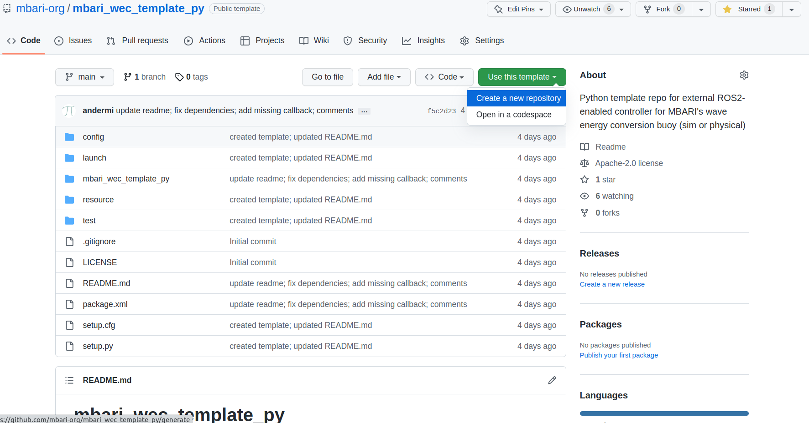

# Quick Start &mdash; Writing External Controller With GitHub Template Repository
---

In this tutorial, you will make and customize a GitHub repository from a GitHub Template with
a ROS 2 Python package and code ready to implement your own external controller utilizing the
`buoy_api_py` interface. This interface may be used with the both the simulated and physical buoy.

## Interfaces and Templates

There are two GitHub
[template repositories](https://docs.github.com/en/repositories/creating-and-managing-repositories/creating-a-repository-from-a-template)
set up (C++/Python) for a quick start on writing a
custom controller utilizing
[buoy_api_cpp](https://github.com/osrf/mbari_wec_utils/tree/main/buoy_api_cpp) and
[buoy_api_py](https://github.com/osrf/mbari_wec_utils/tree/main/buoy_api_py). Please see
[C++ examples](https://github.com/osrf/mbari_wec_utils/tree/main/buoy_api_cpp/examples) and
[Python examples](https://github.com/osrf/mbari_wec_utils/tree/main/buoy_api_py/buoy_api/examples) for example
controller implementations.

* [mbari_wec_template_cpp](https://github.com/mbari-org/mbari_wec_template_cpp)
* [mbari_wec_template_py](https://github.com/mbari-org/mbari_wec_template_py)

---

## Using Python Template

### Creating your own repo from the template

You may also refer to GitHub's
[template documentation](https://docs.github.com/en/repositories/creating-and-managing-repositories/creating-a-repository-from-a-template)

To start using the Python GitHub template

1. Navigate to
[mbari_wec_template_py](https://github.com/mbari-org/mbari_wec_template_py) and click the green
button with the text `Use this template` and select `Create a new repository`

    

2. Next, set up the repository like you would any new GitHub repository choosing the owner,
repository name, public/private, etc.
3. Make a ROS 2 workspace
   ```
   $ mkdir -p ~/controller_ws/src
   $ cd ~/controller_ws/src
   ```
4. Now that your new repository is set up, clone it to your local machine, make a branch, etc.  
   ```
   $ git clone https://github.com/<owner>/<repo_name>.git
   $ cd ~/controller_ws
   ```

You should now have a Python ROS 2 package with the following structure:

```
<repo_name>
    ├── config
    │   └── controller.yaml
    ├── launch
    │   └── controller.launch.py
    ├── LICENSE
    ├── mbari_wec_template_py
    │   ├── controller.py
    │   └── __init__.py
    ├── package.xml
    ├── README.md
    ├── resource
    │   └── mbari_wec_template_py
    ├── setup.cfg
    ├── setup.py
    └── test
        ├── test_copyright.py
        ├── test_flake8.py
        └── test_pep257.py
```

### Customizing the controller

You may also refer to the `README.md` in your newly cloned repository.

#### Modify template for your package
Replace `mbari_wec_template_py` with your package name and modify other fields as necessary in:

- package.xml (lines 4-8)

``` xml linenums="1" hl_lines="4 5 6 7 8" title="package.xml"
<?xml version="1.0"?>
<?xml-model href="http://download.ros.org/schema/package_format3.xsd" schematypens="http://www.w3.org/2001/XMLSchema"?>
<package format="3">
  <name>repo_name</name>  <!-- Update package name -->
  <version>3.14</version>  <!-- Update version -->
  <description>Your Controller Description</description>  <!-- Update description -->
  <maintainer email="your@email">Your Name</maintainer>  <!-- Update email and name -->
  <license>Your License</license>  <!-- Update license -->
```


- setup.py (lines 7, 11, 22-25, 29)

``` py linenums="7" hl_lines="1 5 16 17 18 19 23" title="setup.py"
package_name = 'your_package_name'  # Update package name

setup(
    name=package_name,
    version='3.14',  # Update version
    packages=[f'{package_name}'],
    data_files=[
        ('share/ament_index/resource_index/packages',
            ['resource/' + package_name]),
        ('share/' + package_name, ['package.xml']),
        (os.path.join('share', package_name, 'launch'), glob('launch/*.launch.py')),
        (os.path.join('share', package_name, 'config'), glob('config/*.yaml'))
    ],
    install_requires=['setuptools'],
    zip_safe=True,
    maintainer='Your Name',  # Update name
    maintainer_email='your@email',  # Update email
    description='Your package description',  # Update package description
    license='Your License',  # Update license
    tests_require=['pytest'],
    entry_points={
        'console_scripts': [
            f'your_controller_name = {package_name}.controller:main',  # Update controller executable name
```

- setup.cfg (lines 2, 4)  
    Update script_dir and install_scripts locations with your package name

``` ini linenums="1" title="setup.cfg"
[develop]
script_dir=$base/lib/your_package_name
[install]
install_scripts=$base/lib/your_package_name
```

- launch/controller.launch.py (lines 22, 35-36)

``` py linenums="22" hl_lines="1 14 15" title="launch/controller.launch.py"
package_name = 'your_package_name'   # Update package name


def generate_launch_description():
    ld = LaunchDescription()
    config = os.path.join(
        get_package_share_directory(package_name),
        'config',
        'controller.yaml'
        )

    node = Node(
        package=package_name,
        name='your_controller_name',  # Update controller name (same as name in config.yaml)
        executable='your_controller_name',  # Update controller executable name from setup.py
```

- config/controller.yaml (line 1)  
    Update first line with your controller name (same as node name in launch file)

``` yaml linenums="1" hl_lines="1" title="config/controller.yaml"
/your_controller_name:
  ros__parameters:
    foo: 1.0
```

and rename two files/folders

- the empty file `resource/mbari_wec_template_py`
- the Python package `mbari_wec_template_py` containing `controller.py`

resulting in the following folder structure:

```
repo_name
    ├── config
    │   └── controller.yaml
    ├── launch
    │   └── controller.launch.py
    ├── LICENSE
    ├── your_package_name
    │   ├── controller.py
    │   └── __init__.py
    ├── package.xml
    ├── README.md
    ├── resource
    │   └── your_package_name
    ├── setup.cfg
    ├── setup.py
    └── test
        ├── test_copyright.py
        ├── test_flake8.py
        └── test_pep257.py
```

Modify `setup.py` as desired and add any dependencies in `package.xml` following standard ROS 2
documentation.

---

## Implement Controller
Assuming you have followed the above and renamed the Python package `mbari_wec_template_py` to your package name,
`<your_package_name>/controller.py` is stubbed out to implement your custom external controller.
You may also use `config/controller.yaml` for any policy parameters.

### ControlPolicy

You may use the class `ControlPolicy` in `<your_package_name>/controller.py` to implement your controller.

``` py linenums="21"
class ControlPolicy(object):

    def __init__(self):
        # Define any parameter variables here
        self.foo = 1.0

        self.update_params()

    def update_params(self):
        """Update dependent variables after reading in params."""
        self.bar = 10.0 * self.foo

        pass  # remove if there's anything to set above

    # Modify function inputs as desired
    def target(self, *args, **kwargs):
        """Calculate target value from feedback inputs."""

        # secret sauce

        return 0.0  # obviously, modify to return proper target value
```

- Set any configurable parameters in `__init__` on line 23

``` py linenums="23"
    def __init__(self):
        # Define any parameter variables here
        self.foo = 1.0

        self.update_params()
```

- Set any dependent variables in `update_params` on line 29

``` py linenums="29"
    def update_params(self):
        """Update dependent variables after reading in params."""
        self.bar = 10.0 * self.foo

        pass  # remove if there's anything to set above
```

- Declare/get/update params in the `set_params` function of the `Controller` class on line 113

``` py linenums="113"
    def set_params(self):
        """Use ROS2 declare_parameter and get_parameter to set policy params."""
        self.declare_parameter('foo', self.policy.foo)
        self.policy.foo = \
            self.get_parameter('foo').get_parameter_value().double_value

        # recompute any dependent variables
        self.policy.update_params()
```

- Then, your control logic will go in the `target` function on line 36.
    Modify the input args as well as the return value as necessary

``` py linenums="35"
    # Modify function inputs as desired
    def target(self, *args, **kwargs):  # noqa: D202
        """Calculate target value from feedback inputs."""

        # secret sauce

        return 0.0  # obviously, modify to return proper target value
```

### Controller

The `Controller` class contains an instance of `ControlPolicy` as the member variable,
`self.policy`. The `self.policy.target` function may be called anywhere within the
`Controller` class. You may call it inside any of the data callbacks to enable feedback
control (for example):

``` py
    # To subscribe to any topic, simply define the specific callback, e.g. power_callback
    def power_callback(self, data):
        '''Callback for '/power_data' topic from Power Controller'''
        # get target value from control policy
        target_value = self.policy.target(data.rpm, data.scale, data.retract)

        # send a command, e.g. winding current
        self.send_pc_wind_curr_command(target_value, blocking=False)
```

Or, set up a loop in `main()` and run open-loop:

``` py linenums="123"
def main():
    rclpy.init()
    controller = Controller()
    rate = controller.create_rate(50.0)  # Hz
    while rclpy.ok():

        # Open-loop control logic

        rclpy.spin_once(controller)
        rate.sleep()
    rclpy.shutdown()
```

You may get feedback data from any of the buoy topics by simply creating a specific callback
listed below. For feedback data you'd like to use in another area of the class, feel free to
assign them to class variables.

(Delete any callbacks you don't need in the `Controller` class)

Available callback functions:

`/ahrs_data` &rarr; `def ahrs_callback(self, data):`  
`/battery_data` &rarr; `def battery_callback(self, data):`  
`/spring_data` &rarr; `def spring_callback(self, data):`  
`/power_data` &rarr; `def power_callback(self, data):`  
`/trefoil_data` &rarr; `def trefoil_callback(self, data):`  
`/powerbuoy_data` &rarr; `def powerbuoy_callback(self, data):`  

You may also send commands from within the `Controller` class:

`self.send_pump_command(duration_mins, blocking=False)`  
`self.send_valve_command(duration_sec, blocking=False)`  
`self.send_pc_wind_curr_command(wind_curr_amps, blocking=False)`  
`self.send_pc_bias_curr_command(bias_curr_amps, blocking=False)`  
`self.send_pc_scale_command(scale_factor, blocking=False)`  
`self.send_pc_retract_command(retract_factor, blocking=False)`  

In the `Controller` constructor, you may also uncomment lines 55 or 56 to set the publish rates for
the Spring or Power Controllers on the buoy. These controllers default to publishing at 10Hz. You
can call commands to set the rates anywhere from 10Hz to 50Hz (default argument is 50Hz).

``` py linenums="46"
    def __init__(self):
        super().__init__('controller')

        self.policy = ControlPolicy()
        self.set_params()

        # set packet rates from controllers here
        # controller defaults to publishing @ 10Hz
        # call these to set rate to 50Hz or provide argument for specific rate
        # self.set_pc_pack_rate_param()  # set PC publish rate to 50Hz
        # self.set_sc_pack_rate_param()  # set SC publish rate to 50Hz
```

## Build, Test, Run

At this point, your new package should build, pass tests, and run against the sim (will connect
but do nothing).

It is assumed that you have already installed or built the buoy packages.

From your workspace (e.g. `~/controller_ws`) build your package:
```
$ colcon build
Starting >>> mbari_wec_template_py
--- stderr: mbari_wec_template_py
/usr/lib/python3/dist-packages/setuptools/command/install.py:34: SetuptoolsDeprecationWarning: setup.py install is deprecated. Use build and pip and other standards-based tools.
  warnings.warn(
---
Finished <<< mbari_wec_template_py [0.74s]

Summary: 1 package finished [0.89s]
  1 package had stderr output: mbari_wec_template_py
```
You may also build only your new controller package (if you have other packages in the workspace)
using:  
`$ colcon build --packages-up-to <your_package_name>`

Then, source and test:
```
$ source install/local_setup.bash
$ colcon test
Starting >>> mbari_wec_template_py
--- stderr: mbari_wec_template_py

=============================== warnings summary ===============================
test/test_flake8.py::test_flake8
test/test_flake8.py::test_flake8
  Warning: SelectableGroups dict interface is deprecated. Use select.

-- Docs: https://docs.pytest.org/en/stable/warnings.html
---
Finished <<< mbari_wec_template_py [0.74s]

Summary: 1 package finished [0.87s]
  1 package had stderr output: mbari_wec_template_py
```
Or, you may test only your new controller package using:  
`$ colcon test --packages-select <your_package_name>`

Next, in another terminal run the sim (after sourcing the sim packages of course):
`$ ros2 launch buoy_gazebo mbari_wec.launch.py`

Now, in the previous terminal, launch the empty controller:
```
$ ros2 launch <your_package_name> controller.launch.py
```

And you should see something similar to:
```
[INFO] [launch]: Default logging verbosity is set to INFO
[INFO] [controller-1]: process started with pid [1409887]
[controller-1] [INFO] [1678130539.867493131] [controller]: Subscribing to <class 'buoy_interfaces.msg._xb_record.XBRecord'> on '/ahrs_data'
[controller-1] [INFO] [1678130540.031500810] [controller]: Subscribing to <class 'buoy_interfaces.msg._bc_record.BCRecord'> on '/battery_data'
[controller-1] [INFO] [1678130540.031972332] [controller]: Subscribing to <class 'buoy_interfaces.msg._sc_record.SCRecord'> on '/spring_data'
[controller-1] [INFO] [1678130540.032390456] [controller]: Subscribing to <class 'buoy_interfaces.msg._pc_record.PCRecord'> on '/power_data'
[controller-1] [INFO] [1678130540.032810815] [controller]: Subscribing to <class 'buoy_interfaces.msg._tf_record.TFRecord'> on '/trefoil_data'
[controller-1] [INFO] [1678130540.033268687] [controller]: Subscribing to <class 'buoy_interfaces.msg._xb_record.XBRecord'> on '/xb_record'
[controller-1] [INFO] [1678130540.033703510] [controller]: Subscribing to <class 'buoy_interfaces.msg._bc_record.BCRecord'> on '/bc_record'
[controller-1] [INFO] [1678130540.034091374] [controller]: Subscribing to <class 'buoy_interfaces.msg._sc_record.SCRecord'> on '/sc_record'
[controller-1] [INFO] [1678130540.034467140] [controller]: Subscribing to <class 'buoy_interfaces.msg._pc_record.PCRecord'> on '/pc_record'
[controller-1] [INFO] [1678130540.034868686] [controller]: Subscribing to <class 'buoy_interfaces.msg._tf_record.TFRecord'> on '/tf_record'
[controller-1] [INFO] [1678130540.035298496] [controller]: Subscribing to <class 'buoy_interfaces.msg._pb_record.PBRecord'> on '/powerbuoy_data'
[controller-1] [INFO] [1678130540.286577653] [controller]: /pc_pack_rate_command not available
[controller-1] [INFO] [1678130540.537643441] [controller]: /sc_pack_rate_command not available
[controller-1] [INFO] [1678130540.538230613] [controller]: Found all required services.
```

---

## Example

An example using this interface will follow in the next tutorial: [Linear Damper Example (Python)](PythonLinearDamperExample.md)

