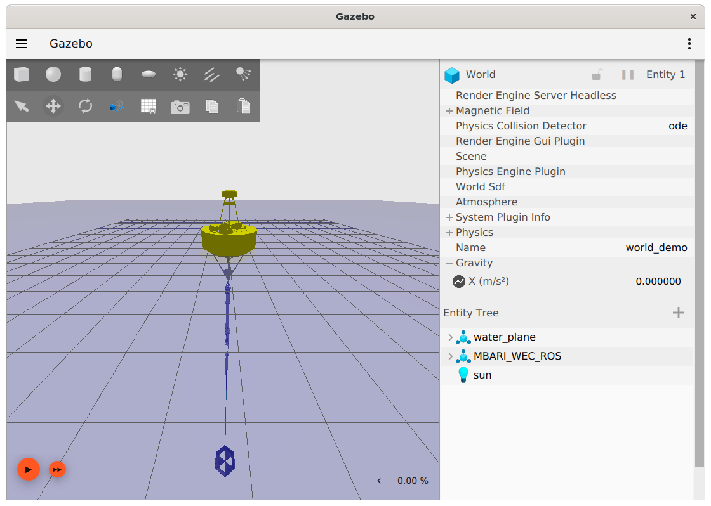

## Introduction

This tutorial will illustrate how to start the buoy simulation in Gazebo, when the simulation is running, a rendering of the buoy system motions will be visible, and ROS2 messages will be published that represent the buoy systems state.  The simulation also provides the same ROS2 services the real buoy does, so will respond to ROS2 messages appropriately.

Subsequent tutorials will illustrate how to view and plot data being published by the simulation, view data logs being generated, and control the simulated buoy with the command-line tool that is available on the buoy.


## How to Run
To run the simulator, it is necessary to source the workspace in a separate terminal than was used to build the application.  Therefore, open a new terminal window and do the following:

1. Source the workspace
```
$ . ~/mbari_wec_ws/install/setup.sh
```
2. Launch the simulation
```
$ ros2 launch buoy_gazebo mbari_wec.launch.py 
```

The Gazebo rendering of the buoy system should become visible and appear as follows:



To start the simulation, press the "play" arrow in the lower left, the buoy should start to move in response to incoming waves.

It is also possible to adjust various parameters such as the sea-state, visibility of the rendering, and speed the simulation will run relative to real-time.  These topics are covered in a later tutorial.

To view the ROS2 messages and associated data while the simulation runs, proceed to the next tutorial: [View ROS2 Messages](SimulatorOutputROS.md)

## Notes on Workspaces
The step of sourcing the workspace is important and must be done in every window that the simulation and associated tools are accessed from.  It is possible, and possibly convenient, to put the source command from step 1 above in the .bashrc or similar place if a different shell is being used.  This will automatically perform this step anytime a new window is opened.  Beware however, the software can not be built from source in a window where this workspace has previously been sourced.  So when re-compiling the source often it can be problematic to have this line in .bashrc.  When primarily running the simulations without frequent re-building of the software, it is then appropriate to use .bashrc in this way, just remember to take it out before opening a window where you want to do a "colcon build".

