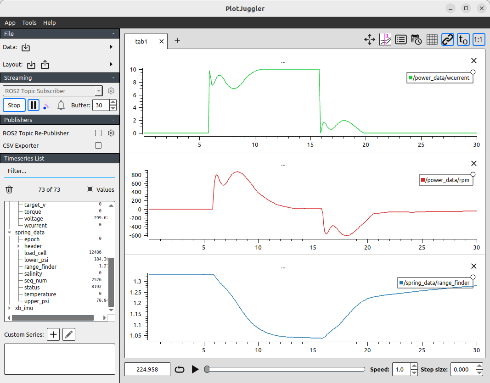

## Run-Time Control using pbcmd

## Introduction
There is a command interpreter running on the physical buoy that provides some control over the behavior of the buoy while it is deployed.  This is a Linux executable that implements a number of commands, accepts appropriate arguments, and issues commands over the CANbus or ROS 2 on the buoy to effect a change of buoy behavior.  These commands can also be issued programmatically as described in subsequent tutorials, but pbcmd is the human interface.  

This same command and interface is implemented in the simulation environment, so it is possible to change the behavior of the simulated buoy from the command line in the same way as can be done on the physical buoy.  However many of the possible commands are not sensible in the simulated environment, so are not implemented, but instead return a message indicating they aren't relevant in simulation.  A key example is the command to open and close the heave-cone doors, because the simulator can not change this behavior while running, the command to do so is inactive.  Similarly, it makes no sense to turn on and off the electrical ground fault detector that exists on the buoy, but does not exist in simulation.

## pbcmd Usage
Issuing 'pbcmd' at the command prompt provides guidance on the possible commands.  In simulation it also indicates which commands are supported in simulation, on the at-sea system, all commands have an effect.  

```
$ ./pbcmd 

pbcmd: Multi-call command Power Buoy dispatcher
Commands currently supported in Simulation:
*               pump  - Spring Controller pump  off or on for a time in minutes <= 10
*              valve  - Spring Controller valve off or on for a time in seconds <= 12
*       sc_pack_rate  - Set the CANBUS packet rate from the spring controller
*           pc_Scale  - Set the scale factor
*         pc_Retract  - Set the retract factor
*        pc_WindCurr  - Set the winding current target
*        pc_BiasCurr  - Set the winding current bias
*        pc_PackRate  - Set the CANBUS packet rate

Commands currently not supported in Simulation:
*             bender  - Sets the state of the bender module
*      reset_battery  - Reset battery controller (caution - no args)

*             tether  - Spring Controller tether power on or off
*       reset_spring  - Reset Spring Controller (caution - no args)

*        pc_VTargMax  - Set the max target voltage
*   pc_ChargeCurrLim  - Set the maximum battery charge current
*     pc_DrawCurrLim  - Set the maximum battery current draw
*      pc_BattSwitch  - Set the battery switch state
*            pc_Gain  - Set the gain scheduler gain
*      pc_StdDevTarg  - Set the target RPM standard deviation

*          tf_SetPos  - Open/close the doors in the heave-cone
*    tf_SetActualPos  - Open/close the doors in the heave-cone
*         tf_SetMode  - Set controller mode
*   tf_SetChargeMode  - Set Battery Charge mode
* tf_SetStateMachine  - Set Battery Charge mode
*      tf_SetCurrLim  - Set controller current limit
*        tf_WatchDog  - Toggle controller watchdog (caution - no args)
*           tf_Reset  - Reset Controller (caution - no args)


For help on a command use the command name, i.e. "bender";

Except the reset commands which take no arguments.

DO NOT enter reset_battery and expect to get help. The command will execute!
```

Note that at the end of this usage message, there is a hint that typing most commands without an argument will supply some further help.


##  Command descriptions

- **pump** - This command turns on and off the gas pump that pumps Nitrogen from the upper pneumatic spring chamber to the lower spring chamber.  The result of this is the mean position of the position will slowly rise.  The rate is about 1 inch per minute of pump action, a required argument for this command specifies how long the pump will run for, in minutes, and must be between 0 and 10.  After this timeout the pump will stop even if no further commands are issued.  A "pump 0" command stops the pump immediately.

- **valve** - The valve command releases Nitrogen gas from the lower chamber to the upper chamber, resulting in the mean position of the piston lowering.  This process is much faster so the required argument for this command is in seconds, and must be between 0 and 10.  After this timeout the valve closes even if no further commands are issued.  A "valve 0" command closes the pump immediately.

- **sc_pack_rate** - This command sets the data packet rate for data coming from the spring controller, the required argument between 10 and 50 indicates the desired data rate in Hz.  This controls the rate of the ROS 2 messages from the spring controller on the buoy, and in the simulator.

- **pc_scale** - This command adjusts the multiplier that is applied to the default motor-current/RPM relationship that is programmed into the power converter.  This value can be from 0.4 to 1.5, allowing a range of damping to be applied.

- **pc_Retract** - This command adjusts an additional multiplier that is applied to the default motor-current/RPM relationship during piston retraction.  This value can be from 0.4 to 1.0, and allows the damping behavior of the system to be asymmetrical, promoting retraction since the pneumatic spring can not pull as hard as the waves can.

- **pc_WindCurr** - This command directly sets the winding current in the electric motor and accepts a value between -35 Amps and +35 Amps.  This value is the quadrature current in the permanent magnet electric motor, and therefore corresponds directly with applied torque. A positive winding current produces a torque that applies a force that retracts the piston. The controller applies this specified torque for two seconds.  After that time, if no new pc_WindCurr command is executed, the system returns to following the default motor-current/RPM relationship (adjusted by the Scale and Retract factor as described).  This allows safety in the case of a communication failure, and makes it a bit impractical to manipulate the winding current manually from the keyboard. As described in subsequent tutorials, programmatically adjusting this value in response to the behavior of the wave-energy converter is the primary automated external control mechanism.

- **pc_BiasCurr** - This command applies an offset to the default motor-current/RPM relationship.  This value can be between -15 Amps and +15 Amps and is applied for 10 seconds before the system reverts to the default motor-current/RPM relationship.  A positive current corresponds to a torque that tends to retract the piston.  This command is useful for temporarily changing the equilibrium point of the piston at sea.


- **pc_pack_rate** - This command sets the data packet rate for data coming from the power converter, the required argument between 10 and 50 indicates the desired data rate in Hz.  This controls the rate of the ROS 2 messages from the power converter on the buoy, and in the simulator.

## Example Usage
As an example, issue the following commands in a terminal where the workspace has been sourced:

1. Launch the simulation without incident waves by issuing the following commands, the first command over-rides the default sea-state and results in no incident wave-forcing on the buoy when the "regenerate_models" flag is set to false:
```
$ empy -D 'inc_wave_spectrum_type="None"' -o ~/buoy_ws/install/buoy_description/share/buoy_description/models/mbari_wec/model.sdf ~/buoy_ws/install/buoy_description/share/buoy_description/models/mbari_wec/model.sdf.em

$ ros2 launch buoy_gazebo mbari_wec.launch.py regenerate_models:=false
```

2. Start the simulation in the GUI by pressing the play button.

3. Start PlotJuggler
```
$ ros2 run plotjuggler plotjuggler &
```

4. Select messages wcurrent and rpm from the /power_data topic and the range_finder message from the /spring_data topic, and then create plots to display these messages in separate windows.

5. Issue the following command to introduce a 10A winding current offset in the motor-current/RPM relationship.

```
$ pc_BiasCurr 10
```

- After 20 seconds of simulation time or so, the plotjuggler window should look approximately as below.  One can see that the command resulted in an additional 10 Amps of motor winding current being present (time = 6 seconds in plot), this additional torque spins the motor and a force is applied to retract the piston, which is evident in the range_finder data.  

- After a 10 second timeout, because no new current over-ride command is issued, the system reverts to the default motor-current/RPM relationship that doesn't include the offset (time = 16 seconds in plot).  After this extra torque is removed, the weight of the heave cone causes the piston to extend back to it's nominal mean position causing the motor to spin in the opposite direction (time = 16-20 seconds in the plot). The default motor-current/RPM relationship is programmed to resist this motion and a smaller positive motor-current is applied during this time.  

- After time = 21 seconds, the energy of the raised heave-cone has been dissipated into the PTO system and the system comes mostly to rest.  The slow creep of the piston beyond 21 seconds is due to the heating effects of the pneumatic spring, heat has been created in the gas spring which slowly dissipates to the environment and the lower spring pressure drops slowly and lowers the piston gradually.




## Exercises
To extend the previous example, some interesting exercises to try are the following:

- Repeat the above example but also plot the battery voltage and current.  Observe how current flows from the battery to raise the piston and heave cone when the pc_BiasCurr 10 command is issued, and then when the timeout occurs, the potential energy of the raised heave cone is converted to electrical energy and current flows into the battery, with a commensurate change in battery voltage.

- Plot the upper and lower spring pressures, observer how they change relative to piston position, and their decay in time after the piston comes to rest.

- Repeatedly issue the "pc_BiasCurr 10" command before the timeout expires, note how the timeout is extended to 10 seconds beyond the last command issued.

- Issue a "pc_WindCurr 10" command instead of the pc_BiasCurr command.  This command directly sets the winding current, so the resulting winding current is not affected by the motor RPM until after the timeout has expired.  For this command, the timeout is two seconds.

- Plot other messages while manipulating the winding current.  Note how the buoy and heave-cone positions as well as the load cell value respond to the dynamics of the floating bodies.