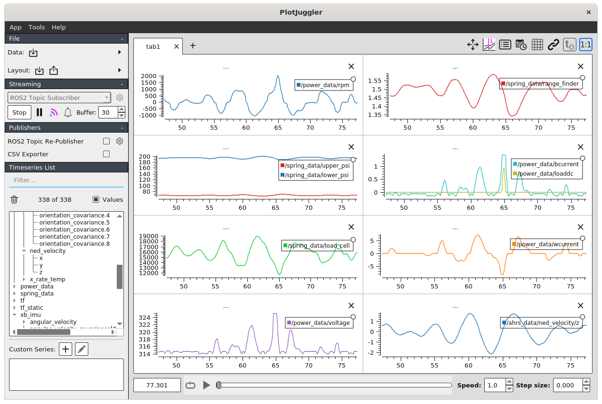

"[PlotJuggler](https://www.plotjuggler.io/)" is a plotting program that includes support for ROS2 messages, and allows real-time plotting of data from ROS2 messages while the simulator runs, as well as plotting of logged data.  

- To install, see instructions [here](https://index.ros.org/p/plotjuggler/).  If using the supplied docker images, this step is not necessary as the software is already installed.

- To start, issue the following command in a window where the environment has already been sourced using ```$ . ~/buoy_ws/install/setup.sh```:

```
$ ros2 run plotjuggler plotjuggler 
```
 
- After an entertaining splash-screen, a blank PlotJuggler screen will appear. Under "Streaming" (upper left, second item below "File"), select the "ROS2 Topic Subscriber" option and click "Start".  A new window will appear showing the ROS2 topics available on the system.  Note that the Gazebo Simulator of the buoy must be running for the ROS2 topics that contain the buoy data to be present.

Select the /arhs_data, /power_data, /spring_data, battery_data, heavecone_data and /xb_data topics and click "OK"

- The selected topics will appear in the "Timeseries List" window, and selecting the carot to the left of each topic will expand them and show the data that can be plotted.  Note that these topics and data are the same as are visible using the ```$ ros2 topic list``` and ```$ ros2 topic echo ...``` commands from the command-line.


- Dragging any data item into the plot field on the right will plot that data on a scrolling graph. The time-extent of the graph can be changed using the "Buffer" text-box under the "Streaming" box in the upper left.  Graphs can be split horizontally and vertically to make room for more data items, see this guide for information on manipulating the PlotJuggler windows.

- After a bit of data selection, the window can look like the example below and show many data items in real-time.  Under the "File" box in the upper left, there are options to save and retrieve this layout to avoid setting up the windows at each invocation of PlotJuggler.  PlotJuggler will continue to run through re-starts of the simulator, so it is often not necessary to re-start PlotJuggler often.



