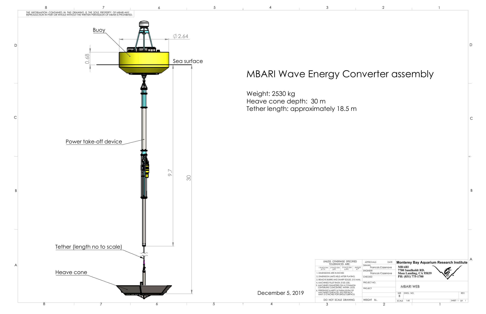

The MBARI Wave-Energy-Converter is a small point absorber design that includes a surface expression, an electro-hydraulic PTO, and a submerged heave-cone device.
The system is moored to the seafloor (typically in 80m of water) through a chain-catenary mooring connected to an anchor.
As waves excite the system, a differential motion results between the buoy at the surface and the submerged heave cone.  
Resisting this motion results in energy being absorbed by the system, and this energy is converted to electrical form and stored in a battery bank on the buoy. The rest of this section provides details about the various components of the system

# Buoy, Heave Cone, and Mooring
The buoy

# Electrical System

# Compute and Control Systems

# Sensors
### Load Cell
### Buoy IMU
### Heave Cone IMU

# Instrumentation Interface

